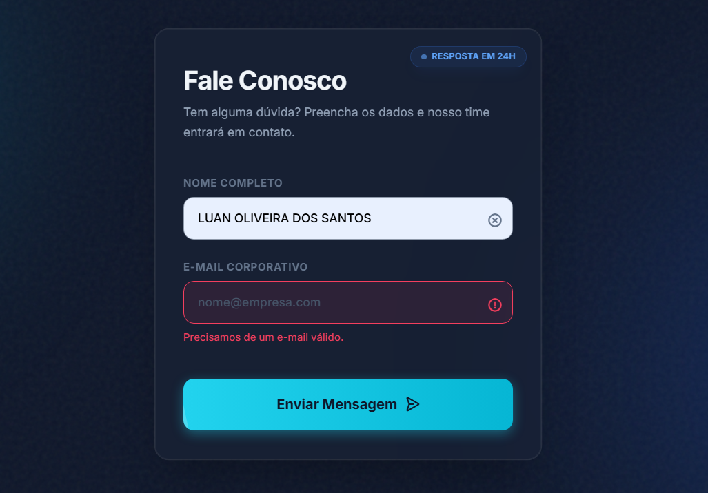

# missao04
Missão do Dia: Validação Simples de Formulário
a# 🎨 Validação de Formulário - UI Design Showcase

Este projeto é uma demonstração prática de aplicação progressiva de regras de UI Design (Interface de Usuário) e UX (Experiência do Usuário), transformando um formulário de contato simples em uma experiência digital premium e responsiva.

## 🎨 Evolução do Design

O projeto foi construído seguindo 5 etapas lógicas de refinamento visual:

### 1. Fundamentos Visuais (Visual Foundation)

**Regra 60-30-10 (Dark Mode):**
- 60% Fundo Slate-900
- 30% Cards Slate-800
- 10% Destaques Cyan-400

**Espaço Negativo:** Uso generoso de padding e gap para criar respiro.

**Consistência:** Bordas arredondadas (rounded-2xl) uniformes em todos os elementos.

### 2. Hierarquia e Foco

**Tipografia Escalar:** Contraste drástico entre títulos (text-3xl) e rótulos (text-xs uppercase).

**Cores Semânticas:**
- 🟦 Azul: Informação neutra (Badge "Resposta em 24h").
- 🟥 Rose: Erros de validação.
- 🟩 Emerald: Sucesso.

**Proximidade:** Agrupamento lógico de labels e inputs.

### 3. Interatividade e "Vida"

**Micro-interações:** Feedback tátil (active:scale-95) nos botões.

**Staggered Animation:** Elementos entram em cascata (um após o outro) ao carregar a página.

**Hover Ricos:** Inputs e botões reagem com brilho e sombras ao passar o mouse.

### 4. Padrões de UX

**Skeleton Screens:** Estado de carregamento pulsante inicial para reduzir a ansiedade de espera.

**Afordância Sob Demanda (Progressive Disclosure):** Botões de "Limpar campo" (X) que só aparecem quando o usuário digita, mantendo a interface limpa.

**Feedback de Loading:** Botão exibe um spinner durante o "envio" dos dados.

### 5. Estética Avançada (Polish)

**Glassmorphism:** Efeito de vidro fosco (backdrop-blur) no card principal.

**Iluminação Ambiental:** "Orbs" de luz (Ciano e Azul) flutuando no fundo para criar profundidade.

**Textura (Noise):** Camada sutil de ruído para remover o aspecto "plástico" das cores digitais.

## 🛠️ Tecnologias Utilizadas

- **HTML5 & CSS3**
- **Tailwind CSS** (via CDN): Para estilização utilitária rápida e consistente.
- **JavaScript (Vanilla)**: Para lógica de validação, manipulação do DOM e animações.
- **Phosphor Icons**: Biblioteca de ícones moderna e flexível.
- **Inter Font**: Tipografia padrão para interfaces limpas.

## 🚀 Como Executar

Como este projeto é autocontido em um único arquivo HTML, a execução é extremamente simples:

1. Baixe o arquivo `index.html`.
2. Abra o arquivo diretamente em qualquer navegador moderno (Chrome, Firefox, Edge, Safari).
3. Não é necessário instalar dependências ou rodar servidores locais.

## 🧩 Funcionalidades Lógicas

Além do visual, o formulário possui validações funcionais:

- **Interceptação de Submit:** O envio padrão é prevenido para validação no cliente.
- **Validação de Campos Vazios:** Impede o envio se Nome ou E-mail estiverem em branco.
- **Validação de Formato de E-mail:** Verifica padrões básicos de e-mail (Regex).
- **Feedback Visual de Erro:** Bordas vermelhas, ícones de alerta e mensagens de texto aparecem dinamicamente.
- **Auto-Correção:** O estado de erro desaparece assim que o usuário começa a corrigir o campo.
- **Simulação de API:** Simula um atraso de rede (delay) antes de mostrar a mensagem de sucesso.

## 📂 Estrutura de Arquivos

```
/
└── index.html       # Contém todo o HTML, CSS e JS da aplicação
└── README.md        # Este arquivo
```

---

Desenvolvido como exercício de aplicação de regras avançadas de UI Design.

